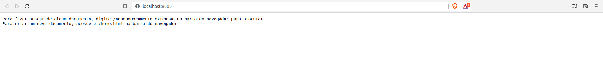
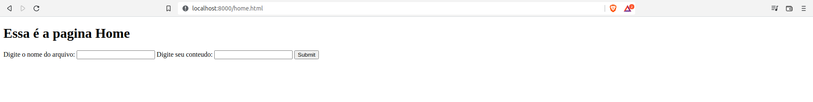
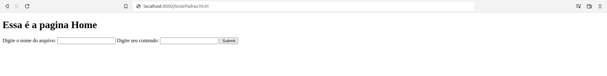
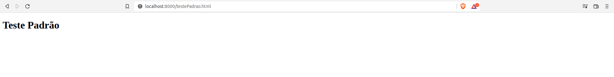
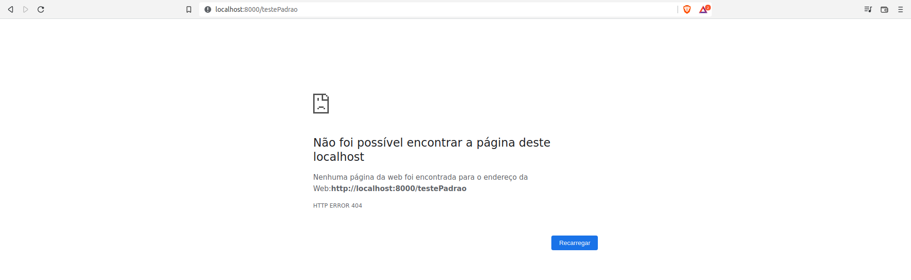
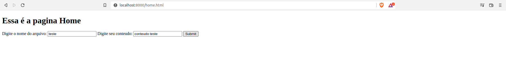
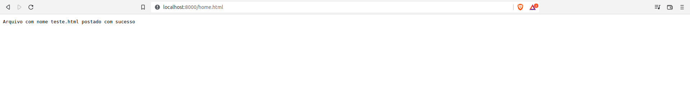
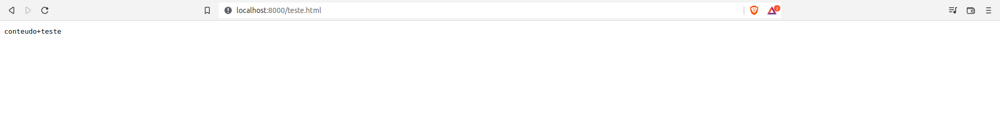

# Servidor Node - TCP
Criação de um servidor utilizando node.js, implementando TCP.

# Como funcionar no seu computador:
1. Faça o clone do respositório:
```
git clone https://github.com/yagomoraescalindra/nodeServer-TCP.git 
```

2. Faça o download das dependências:
```
npm install
```

3. Para iniciar o servidor:
```
npm start
```

OBS: Para inicar usando as dependecias de desenvolvimento:
```
npm run dev
```
# Métodos Implementados:
- GET
- POST

## GET:
Retorna a existência de alguma página html existente no caminho, caso não tenha retorna a não existência da mesma.





É possivel fazer um teste padrão, para verificação se existe ou não o arquivo.








## POST: 
Responsável pela criação da página html de maneira simplificada (nome do arquivo e conteúdo).







# Atualizações para o futuro:
- Implementação do método PUT
- Implementação do método DELETE
- Visibilidade para outros tipos de arquivo (.pdf, .png)